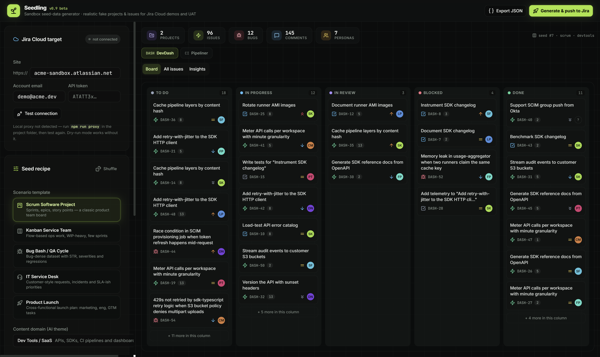
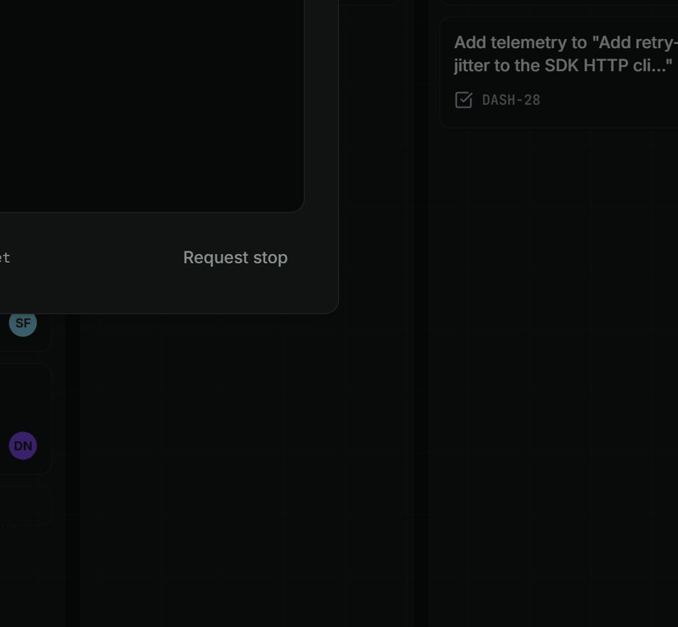

<div align="center">

# 🌱 Seedling

**Realistic fake Jira projects & issues for sandboxes, demos and UAT — generated in seconds.**

[](https://github.com/berkkarabacak/sandbox-seed-generator/actions/workflows/ci.yml)
[](https://github.com/berkkarabacak/sandbox-seed-generator/actions/workflows/deploy.yml)
[](https://berkkarabacak.github.io/sandbox-seed-generator/)
[](LICENSE)

<a href="https://berkkarabacak.github.io/sandbox-seed-generator/">
  
</a>

<br>



*The push console: rehearse the whole REST pipeline in dry-run, or write it for real.*

</div>

## Why

Empty Jira sandboxes make terrible demos, and hand-writing 100 believable tickets is nobody's job.
Seedling synthesizes a complete, coherent project history — epics, stories, bugs with steps-to-reproduce,
sprints, comments, personas — then **rehearses the push** (dry-run) or **writes it for real** to your
Jira Cloud sandbox (live push).

## Features

- 🎭 **5 scenario templates** — Scrum, Kanban service team, Bug Bash / QA cycle, IT service desk, product launch
- 🧠 **6 AI content domains** — fintech, e-commerce, healthcare, dev tools, gaming, logistics
- ✨ **One-click presets** — Executive demo, UAT deep-dive, QA training, Load test (640 issues), Service desk sim
- 🗂 **Full Jira data model** — epics, sub-tasks, sprints, fix versions, components, story points, labels,
  due dates, time tracking, watchers & votes, attachments, typed issue links (blocks / duplicates / clones / relates)
- 👥 **Generated team personas** — names, roles, avatars, timezones, workload distribution
- 📋 **Five live previews** — kanban board, filterable issue table, insights charts (type / status / timeline /
  workload / sprint velocity), team directory, activity feed
- 🖥 **Push console** — stepper + terminal log; dry-run simulation or live push via a zero-dependency local proxy
- 🧹 **Sandbox cleanup** — every live push is recorded locally; wipe it from Jira later with one click
- 📦 **Exports** — dataset JSON, plus **Jira-compatible CSV** per project (ready for Jira's CSV importer)
- 🔗 **Shareable recipes** — copy a URL with the exact recipe encoded, or save named recipes locally
- 🔒 **Token stays local** — credentials are relayed per-request by the local proxy, never stored

## Quick start

```bash
git clone https://github.com/berkkarabacak/sandbox-seed-generator.git
cd sandbox-seed-generator
npm install
npm run dev        # UI on http://localhost:3000
npm run proxy      # Jira relay on http://localhost:8787 (required for live push only)
```

The vite dev server forwards `/jira/*` to the proxy (`vite.config.ts → server.proxy`),
so the browser only ever talks to localhost.

## Modes

| Mode | What happens |
|---|---|
| **Dry-run** | Simulates the whole REST pipeline in a console — zero writes, no token needed. |
| **Live push** | Creates real projects, epics, stories/tasks/bugs/sub-tasks, comments and issue links in your sandbox. |

## Live push notes

- Auth: Basic auth with your Atlassian account email + API token
  (create one at https://id.atlassian.com/manage-profile/security/api-tokens).
- Creating projects requires Jira **admin** permission on the target site.
- Fake personas can't be Jira users: issues are assigned round-robin to real
  assignable users found in the sandbox; persona/reporter/points/sprint are
  preserved in each description's *seed metadata* footer.
- Comments are capped (2 per issue, 120 per project) to stay rate-limit friendly;
  the full dataset is always available via **Export JSON**.
- Sprints are created best-effort when an agile board exists on the new project.
- On the static [GitHub Pages demo](https://berkkarabacak.github.io/sandbox-seed-generator/),
  live push is unavailable (no local proxy) — everything else works.

## Stack

React 19 · TypeScript · Vite · Tailwind · shadcn/ui · recharts · zero-dependency Node proxy (`server/jira-proxy.mjs`)
